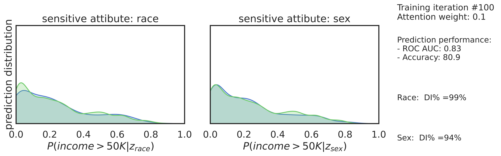

# GAN Based Adversarial Network

## Model

Below figure describe our full model.


## Setup

Use Pip to create a new environment and install dependency from `requirement.txt` file. The following command will install the packages according to the configuration file `requirement.txt`.

```
pip install -r requirements.txt
```

<!-- conda env create -n mlseed -f ./envs/conda_env.yml

conda activate mlseed

cd project -->

## Experiment

After setup the required folders and package run the following command for the experiment.

```
python project/train.py \
    --root_dir <YOUR_ROOT_DIR> \
    --dataset_dir <YOUR_DATAASET_DIR> \
    --batch_size 64 \
    --iteration 10 \
    --gpu YGPU_NUMBER> \
    --test_size 0.2
```

Without GPU

```
python project/train.py \
    --root_dir <YOUR_ROOT_DIR> \
    --dataset_dir <YOUR_DATAASET_DIR> \
    --batch_size 64 \
    --iteration 10 \
    --test_size 0.2
```

A new folder "visualization" will be created automatically, and for each iteration the result graph with accuracy, ROC AUC and DI (%) will be saved in the visualization directory.

## Result

   |   
:-------------------------:|:-------------------------:
**Result from our experiment**  |  **Previously implementated result**

>**From our experiment, we got the following result**


<!--    |   
:-------------------------:|:-------------------------:
**DI vs Attention Weight**  |  **Accuracy vs Attention Weight** -->


**DI vs Attention Weight**
